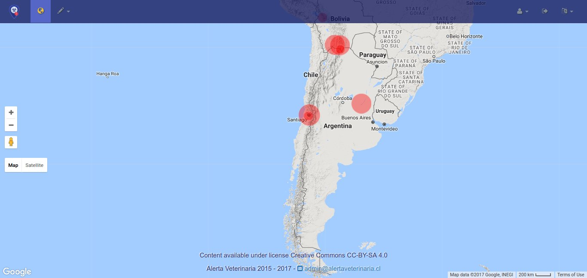

 

 ***Alerta Veterinaria*** is a web application I created as a personal project after I learned how to develop webapps in Python. The project began in  2015 and intended to adress the lack of an open platform where Veterinarians could notify its colleagues and government authorities whenever they may come across an outbreak of any animal disease of veterinary interest.

***Alerta Veterinaria*** was implemented using Python v2.7 in the [App Engine](https://cloud.google.com/appengine) platform of [Google Cloud Platfom](https://cloud.google.com), and it uses the [Google Maps Javascript API](https://developers.google.com/maps/documentation/javascript/overview) to present the reports dynamically. Each report is placed on the map as a semi-transparent circle whose size is adjusted according to the number of cases reported.

While doing this project I learned how to develop a full-stack web application, including principles of graphic and web design, implementing Bootstrap libraries, modeling data for a non-relational database, backend user authorisation, data validation and processing, prevention of CSRF attacks, and how to implement a REST API.

The application is fully functional and it implemented all the user-facing interface pages. <ins>___To Do___</ins>: Finishing the Administration area to allow managing all the users and reports data from within the application itself instead of via the APP Engine console.

Sadly, I did not manage to secure the committment of interested parties to support the development and eventual transfer of the management of the platform. Therefore, though the application is currently still available as a proof of concept, all development has been halted since 2017 awaiting for better conditions. Nonetheless, I still intend to see it through someday though it will require upgrading it to modern standards.

***The project demo is available*** <a href="https://alertaveterinaria.cl" class="btn btn-outline-dark" target="_blank">Here</a>
