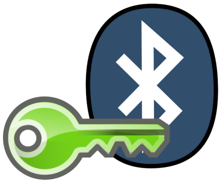
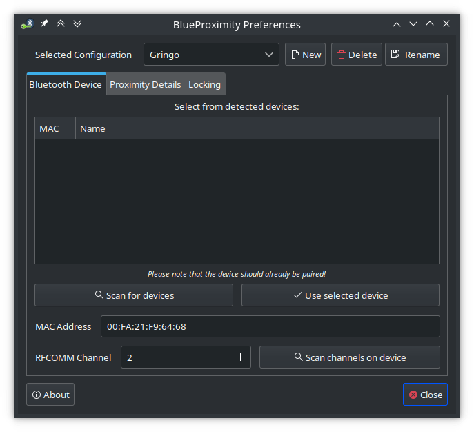

 

***BlueProximity*** is a python desktop application for Linux systemscreated originally by Lars Friedrichs back in 2007. However, the original code was abandoned at some point and it would only support Python v2.7, so when Python 2.7 reached End-of-Life stage, all Linux distributions began dropping support for it. Therefore this magnificent application stopped working as it was not compatible with Python 3.

As the original author didn't update the application then, I decided to update it myself, trying my hand with desktop applications. Once I managed to make the application work again, I tried to contact the original author to submit my changes, but he never replied so I opted for definitely forking the codebase and publishing it, as the source code was made available under the GPL v.2 license.

***BlueProximity v.1.3+*** was implemented using Phython 3.8, and it also required to upgrade its libraries so it would work on GTK v.3+.

While developing this product I learned how to work with Graphical User Interfaces in a desktop application. Before this, my main working environment was exclusively web applications. I also learned a bit about building AppImage packages, which are quite convenient for releasing Linux software, as they include all the different libraries required. Hence, they avoid dependency problems, specially for users of Linux distributions that are quite different from my own system.

___To Do___: As my focus has been on other projects and daily activities, the codebase is a bit outdated. Therefore, I intend to update it to newer Python and GTK versions, while also figuring out how to build  different Linux packages so that it may be easily integrated by the main distributions of Linux.

***The open-source code repository is available on*** [Github](https://github.com/tiktaalik-dev/blueproximity).
